# Sto. Rosario Parish Church App Flow

The app starts when the user opens the mobile application. In `main.dart`, the app initializes Firebase and then checks the current authentication state in `AuthGate`. If the user is already signed in, the app redirects them to the main dashboard; if not, it opens the landing page where the user can sign up, log in, or continue as a guest.

From the landing page, the user enters the system with two possible access paths. A guest user can still browse public church information such as the home screen, contact details, announcements, church history, AI chat, and donation pages. A registered parishioner gets full access to the dashboard and can use all personal features like booking sacraments, tracking requests, updating their profile, and requesting certificates.

Once inside the dashboard, the user can navigate through the main sections of the app. The dashboard acts as the central hub and contains the header, menu, notifications, and bottom navigation. From there, the user can open the Home section, Bookings, Donations, Certificates, Profile, and other parish information pages. The Home page loads church schedules, valid sacrament options, and user-related details so the user can immediately decide what to do next.

The most important flow in the app is the sacrament booking process. The user selects a sacrament from the Home screen, fills out the service form, and enters the required information such as personal details, service information, and supporting documents if needed. The app checks whether the request is valid, verifies the required fields, and confirms whether the user is eligible for that sacrament based on age or other rules. Once the user submits the form, the request is sent to Firebase or a Cloud Function for processing, and the data is saved in Firestore. The Bookings page then refreshes and shows the new record along with its status.

The Bookings section serves as the user’s service tracking center. It loads the current user’s records, sorts them by recent submission date, and displays each booking’s type and status. If no bookings exist yet, the app shows an empty state with an option to start a new booking. Because the app listens to Firestore updates, the list changes in real time as new submissions are made or statuses are updated.

The donation or offering flow is another important business process. The user chooses the donation type, fills in the amount and donor details, and validates information such as phone number and amount. If the donation requires payment, the app sends the request through the backend payment system and uses Xendit for processing. After the payment is completed, the app verifies the returned payment status through the deep link and shows a confirmation message when the payment is confirmed. If the payment fails or remains pending, the app shows the correct error or waiting state instead of marking it as successful.

The certificate feature follows a similar request-based flow. The user opens the Certificates screen, loads their existing requests, and chooses a type such as baptism, confirmation, or marriage certificate. Before submission, the app shows a consent message reminding the user that the request may involve a fee and that the certificate must be claimed at the parish. After the user agrees, the app submits the certificate request through a Cloud Function and stores it in Firestore. The certificate list updates afterward, and if a soft copy is available, it can be opened in the viewer.

The profile management flow allows a registered user to maintain their parish account details. They can update their name, phone number, address, and profile photo. The app loads the existing profile data from Firestore, validates the entered address, and saves the final changes to the database. This makes the app more personal and also supports better service requests and record matching.

The app also includes church information and communication features. The parish history page, mass schedule, announcements, and contact page give users access to important church information. These pages are mainly informational but are essential for keeping parishioners updated and engaged with the church community.

Finally, the app includes an AI assistant that helps users ask practical questions about parish services, mass schedule, fees, bookings, and church activities. The assistant detects whether the user is asking in Tagalog or English and responds in the same language. It uses parish-specific context to give helpful answers and stores chat history for future reference.

Overall, the flow of the app is: open app, check login, enter dashboard, choose a feature, load data, submit a request or transaction, validate and save the information, update the UI, and notify the user with the final status. In short, this app acts as a digital parish operations platform where a parishioner can access church information, request services, pay offerings, manage personal records, and stay connected to the parish through one integrated mobile system.

## Application ERD

The app uses Firebase Authentication, Cloud Firestore, Firebase Storage, and Cloud Functions. The diagram below covers the Firestore collections and their logical relationships used by the mobile app and its backend.

```mermaid
erDiagram
    AUTH_ACCOUNT {
        string uid PK
        string email
        string displayName
    }

    PARISH_USER {
        string documentId PK
        string structuredId
        string uid FK
        string name
        string email
        string phone
        timestamp birthday
        string address
        string barangay
        string profileImage
        string role
        string status
        timestamp createdAt
        timestamp lastLogin
    }

    BOOKING {
        string documentId PK
        string structuredId
        string userId FK
        string userName
        string userEmail
        string sacramentTypeKey
        string sacramentType
        string date
        string time
        map details
        string status
        string assignedPriest
        string adminNotes
        map payment
        timestamp submittedAt
        timestamp updatedAt
    }

    REQUIREMENT {
        string documentId PK
        string structuredId
        string userId FK
        string bookingId FK
        string sacramentType
        string requirementType
        string documentUrl
        string documentName
        string status
        map validationResult
        string sourceCertificateRequestId FK
        timestamp uploadedAt
    }

    BOOKING_REQUIREMENT {
        string documentId PK
        string serviceKey
        map fields
        list requirements
        map fees
        map schedules
        boolean active
    }

    BOOKING_FORM {
        string formKey PK
        string sacramentTypeKey
        string formName
        map displayNames
        map descriptions
        list fields
        list requirements
        map fees
        map schedules
        boolean active
        timestamp updatedAt
    }

    DONATION {
        string documentId PK
        string structuredId
        string userId FK
        string userName
        string userEmail
        string donationType
        boolean isAnonymous
        number amount
        string currency
        string paymentMethod
        string status
        map xendit
        timestamp submittedAt
    }

    MASS_OFFERING {
        string documentId PK
        string structuredId
        string userId FK
        string userName
        string userEmail
        number amount
        string currency
        string paymentMethod
        string offeringLocation
        string status
        timestamp submittedAt
    }

    DONATION_DRIVE {
        string documentId PK
        string title
        string status
        timestamp endDate
        list allowedDonationTypes
    }

    DONATION_SUBMISSION {
        string documentId PK
        string driveId FK
        string driveTitle
        string userUid FK
        string donationType
        boolean isAnonymous
        string name
        string email
        string phone
        number amount
        string item
        string quantity
        string condition
        string deliveryMethod
        string details
        timestamp createdAt
    }

    CERTIFICATE {
        string documentId PK
        string parishionerId FK
        string certificateType
        string type
    }

    CERTIFICATE_RECORD {
        string documentId PK
        string userId FK
        string certificateType
        string type
    }

    CERTIFICATE_REQUEST {
        string documentId PK
        string userId FK
        string certificateRecordId FK
        string certificateType
        string certificateName
        string status
        string adminNotes
        string softCopyUrl
        timestamp requestDate
        timestamp updatedAt
    }

    MASS_SCHEDULE {
        string documentId PK
        string dayOfWeek
        string startTime
        string endTime
        boolean active
    }

    ANNOUNCEMENT {
        string documentId PK
        string title
        string body
        string content
        string status
        timestamp createdAt
    }

    PARISH_PROFILE {
        string documentId PK
        string name
        string address
        string phone
        string email
        map services
        map serviceFees
        map massSchedule
        timestamp updatedAt
    }

    SERVICE_FEE {
        string documentId PK
        string serviceKey
        map feeDetails
        timestamp updatedAt
    }

    SERVICE_CATALOG {
        string documentId PK
        string sourceCollection
        string serviceKey
        string name
        string description
        map fees
        map formDefinition
    }

    COUNTER {
        string prefix PK
        number count
        timestamp createdAt
    }

    AUDIT_LOG {
        string documentId PK
        string userId FK
        string userName
        string userEmail
        string action
        string targetType
        string targetId
        map details
        timestamp createdAt
    }

    PASSWORD_RESET_OTP {
        string email PK
        string otp
        number attempts
        timestamp createdAt
        timestamp expiresAt
    }

    SIGNUP_OTP {
        string documentId PK
        string email
        string otpHash
        string salt
        number attempts
        timestamp usedAt
        timestamp createdAt
        timestamp updatedAt
        timestamp expiresAt
    }

    BOOKING_AVAILABILITY {
        string documentId PK
        map availabilityData
    }

    SCHEDULING_AUDIT {
        string documentId PK
        string userId FK
        map auditData
    }

    BOOKING_CONFLICT {
        string documentId PK
        string userId FK
        map conflictData
    }

    LEGACY_SACRAMENT_REQUEST {
        string documentId PK
        string userId FK
        string sacramentType
        map details
        string status
        timestamp submittedAt
        timestamp updatedAt
    }

    AUTH_ACCOUNT ||--o| PARISH_USER : "profile for"
    AUTH_ACCOUNT ||--o{ BOOKING : "submits"
    AUTH_ACCOUNT ||--o{ REQUIREMENT : "uploads"
    AUTH_ACCOUNT o|--o{ DONATION : "may submit"
    AUTH_ACCOUNT o|--o{ MASS_OFFERING : "may submit"
    AUTH_ACCOUNT o|--o{ DONATION_SUBMISSION : "may submit as userUid"
    DONATION_DRIVE ||--o{ DONATION_SUBMISSION : "accepts"
    AUTH_ACCOUNT ||--o{ CERTIFICATE_RECORD : "has"
    AUTH_ACCOUNT ||--o{ CERTIFICATE_REQUEST : "requests"
    CERTIFICATE ||--o{ CERTIFICATE_REQUEST : "requested from"
    AUTH_ACCOUNT ||--o{ AUDIT_LOG : "acts in"
    AUTH_ACCOUNT ||--o{ LEGACY_SACRAMENT_REQUEST : "legacy request"
    BOOKING o|--o{ REQUIREMENT : "has supporting documents"
    CERTIFICATE_REQUEST o|--o{ REQUIREMENT : "may satisfy a requirement"
```

### ERD entity-to-collection mapping

| ERD entity | Firebase source |
|---|---|
| `AUTH_ACCOUNT` | Firebase Authentication |
| `PARISH_USER` | `users` |
| `BOOKING` | `bookings` |
| `REQUIREMENT` | `requirements` |
| `BOOKING_REQUIREMENT` | `booking_requirements` |
| `BOOKING_FORM` | `booking_forms` |
| `DONATION` | `donations` |
| `MASS_OFFERING` | `mass_offerings` |
| `DONATION_DRIVE` | `donation_drives` |
| `DONATION_SUBMISSION` | `donation_submissions` |
| `CERTIFICATE` | `certificates` |
| `CERTIFICATE_RECORD` | `certificate_records` (legacy source) |
| `CERTIFICATE_REQUEST` | `certificate_requests` |
| `MASS_SCHEDULE` | `mass_schedules` or legacy `massSchedules` |
| `ANNOUNCEMENT` | `announcements` |
| `PARISH_PROFILE` | `parish_profile` |
| `SERVICE_FEE` | `service_fees` |
| `SERVICE_CATALOG` | Optional legacy sources listed in the ERD notes |
| `COUNTER` | `counters` |
| `AUDIT_LOG` | `audit_logs_app` |
| `PASSWORD_RESET_OTP` | `passwordResetOtps` |
| `SIGNUP_OTP` | `signup_otps` |
| `BOOKING_AVAILABILITY` | `bookingAvailability` (rules-defined) |
| `SCHEDULING_AUDIT` | `schedulingAudit` (rules-defined) |
| `BOOKING_CONFLICT` | `bookingConflicts` (rules-defined) |
| `LEGACY_SACRAMENT_REQUEST` | `sacrament_requests` or `users/{uid}/sacrament_requests` |

### ERD notes

- Firestore is schemaless: document IDs are the primary identifiers, and fields can be optional or vary between records. Nested maps such as booking details, payment data, validation results, and localized form content are summarized above rather than expanded into separate relational tables.
- Relationships marked `FK` are logical references stored as values, not enforced database foreign keys. User references usually contain the Firebase Auth UID; `CERTIFICATE.parishionerId` may instead contain a parishioner identifier. Certificate requests store `certificateRecordId` for the selected `CERTIFICATE` document; older `CERTIFICATE_RECORD` entries are a separate legacy source.
- `DONATION_SUBMISSION` is a separate donation-drive commitment record; it is not the payment-backed `DONATION` or `MASS_OFFERING` record. Guest submissions may have an empty user UID, and guest donations may use a `guest_` user ID.
- `BOOKING_REQUIREMENT` provides the dynamic form definitions used by the sacrament form screen; `BOOKING_FORM` is a separate form-content collection. Both are included because the app/backend read them.
- `SERVICE_CATALOG` represents optional legacy service-content sources the AI assistant can also read: `sacramentServices`, `churchServices`, `serviceFees`, `sacramentFees`, `services`, and `sacrament_configs`. These are fallback/content sources and their document shapes can differ. `booking_requirements` and `booking_forms` are shown separately above.
- `MASS_SCHEDULE` data is read from `mass_schedules` and, for compatibility, `massSchedules`. `LEGACY_SACRAMENT_REQUEST` covers older root-level or user-subcollection requests; current booking records are stored in `bookings`.
- `BOOKING_AVAILABILITY`, `SCHEDULING_AUDIT`, and `BOOKING_CONFLICT` are additional scheduling collections declared by Firestore rules. The rules expose only their document IDs and limited access fields; the app source does not define a stable full document schema for them.
- `COUNTER` documents allocate structured IDs (such as `user_001` and `booking_001`). They are not direct foreign-key relationships. `AUDIT_LOG.targetType` and `targetId` refer polymorphically to different record types.
- `PASSWORD_RESET_OTP` and `SIGNUP_OTP` are short-lived Cloud Function records. Profile images, uploaded requirements, and certificate soft copies use Firebase Storage or external URLs; their file contents are not Firestore entities.
- Parish profile, schedule, announcement, booking-form, booking-requirement, and service-fee documents are configuration/content records rather than parishioner-owned transactional records.
